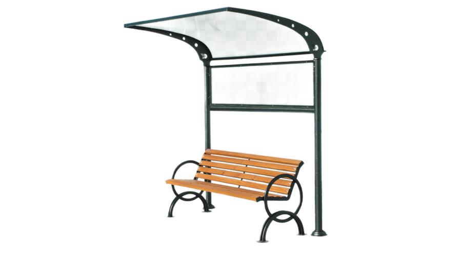

<!DOCTYPE html>
<html class="navigation">
   <head>
	  <meta charset="utf-8">
	  <title>Лавочкин</title>
      <link rel="shortcut icon" href="imag/icona.png">
      <link rel="stylesheet" href="css/stile.css">
      

        <h1>Lавочкин</h1>
      

      <header> <!-- меню -->
        

           

               <a class="nav_link" href="Главная страница.html">Главная</a>
               <a class="nav_link" href="Навигация.html">Навигация</a>
               <a class="nav_link"id="Account" href="Авторизация.html">Аккаунт</a>
           

        

      </header>
   </head>
  <body><!-- основная часть -->
          <main> <!-- основной контент -->
            <form class="FormFirst" method="post">
               <H3 id="AboutUs">О нас</H3>
              

                
Мы сеть бронирования лавочек с навесом. Наши лавочки расположены по периметру города Краснодар. Бронировать можно в любое время, а также в любую погоду.

                
Сеть с уникальной возможностью и неповторимым антуражем.

                
Lавочкин – сайт для доступной  и удобной брони.

              

              
            </form>
          </main>
          <footer>  <!--подвал -->
             
Lавочкин@mail.com

             
557(898)427-48-53

             
Copyright & copy; 2022 Lавочкин

          </footer>
     
  
  </body>
</html>
